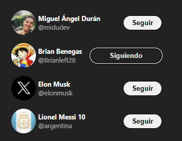

## Twitter card:

Una muestra simple de como funcionan los componentes y estados, simulando un componente de Twitter


  
En este pequeño proyecto, he utilizado componentes reutilizables y estados para introducir, por ejemplo, una lista de usuarios con un array donde tenga las props que le pasaré a mi componente:

## Lista de usuarios:

```javascript
     const users = [
  {
    userName: 'midudev',
    name: 'Miguel Ángel Durán',
    isFollowing: false
  },
  {
    userName: 'Brianleft28',
    name: 'Brian Benegas',
    isFollowing: true
  },
  {
    userName: 'elonmusk',
    name: 'Elon Musk',
    isFollowing: true
  },
  {
    userName: 'argentina',
    name: 'Lionel Messi 10',
    isFollowing: false
  }
 ]
```
## APP JS:

```javascript
// App js
export function App() {
    return (
      <section className="App">
        {
          users.map(({ userName, name, isFollowing })  =>  (
              <TwitterFollowCard
                key={userName}
                userName={userName}
                name={name}
                initialIsFollowing={isFollowing}
                > 
               {name}
              </TwitterFollowCard>
            )
          )
        }
      </section>
  );
}
```
## Componente *TwitterFollowCard* :

```javascript
import { useState } from "react"

export function TwitterFollowCard ({userName, children, initialIsFollowing}) {
  
  const [isFollowing, setIsFollowing] = useState(initialIsFollowing);
 
  const text = isFollowing ? 'Siguiendo' : 'Seguir'
  const buttonClassname = isFollowing 
  ? 'tw-followCard-button is-following'
  : 'tw-followCard-button'

  const handleClick = () => {
    setIsFollowing(!isFollowing)
  }

return (  
    <article className='tw-followCard'> 
        <header className='tw-followCard-header'>
          
          <div className='tw-followCard-info'>
          <strong>{children}</strong>
          <span className='tw-followCard-infoUsername'>@{userName}</span>
          </div>
        </header>
        <aside>
          <button className={buttonClassname} onClick={handleClick}>
            <span className='tw-followCard-text' >{text}</span>
            <span className='tw-follwoCard-stopFollow'>Dejar de seguir</span>
            </button>
        </aside>
    </article>
    )
}
```
* [x] Twitter Follow Card. 

---  

## Videojuego:
En proceso...
* [ ] Videojuego


___
#####  Brianleft28, 2024  